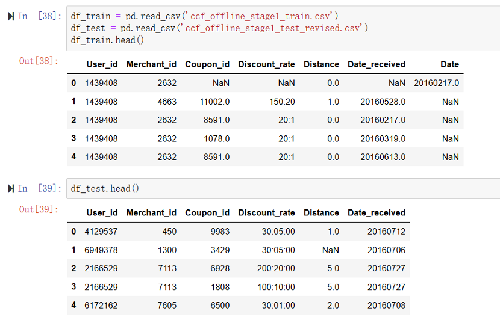
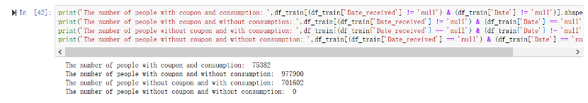
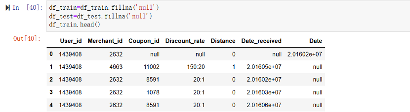
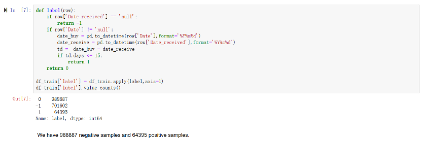
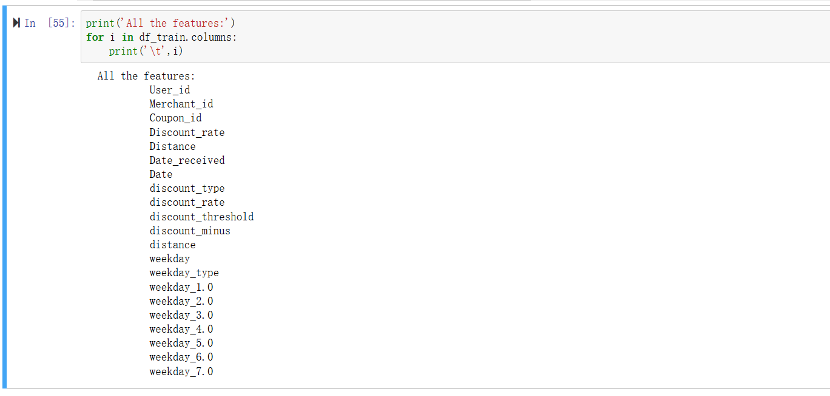
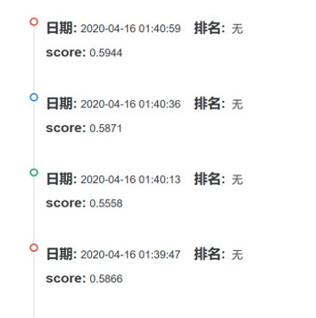
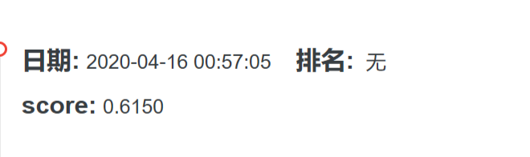
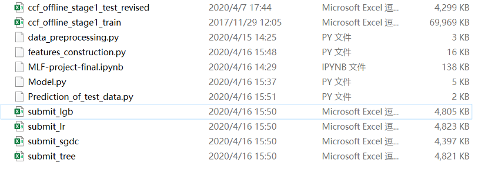

# Group Member & Contribution

|Name|Phone Number|Github|Work|
| -------- | :----:  |:----:  |:----:  |
|Zhang Yijia|1801212815|[YijiaZhang1996](https://github.com/YijiaZhang1996)|Paperwork, Do presentation|
|Deng Ying| 1801212782 |[dy0703](https://github.com/dy0703)| Data Preprocessing, Feature Engineering, Build Model|
|Chen Zhuo| 1901212461| [Igloo7](https://github.com/Igloo7)|Feature Engineering, Build Model|
|Wang Congyuan| 1901212637|[cy-wang15](https://github.com/cy-wang15)|Feature Engineering, Build Model|

# Research Topic
O2O Coupon Consumption Prediction Based on Past Consumer Behavior 

# Research Background

In recent years, O2O (Online to Offline) consumption has gradually entered people's life. According to incomplete statistics, the O2O industry is associated with hundreds of millions of consumers, and all kinds of apps record more than 10 billion user behavior and location records every day. Activating old users with coupons or attracting new customers to shop is an important marketing method of O2O. However, randomly placed coupons cause meaningless interference to most users. For merchants, spamming coupons can reduce brand reputation and make it difficult to estimate marketing costs.

# Research Purpose

This project aims to predict users' usage within 15 days after receiving coupons by analyzing and modeling their past offline consumption behaviors, so as to realize personalized coupon delivery. Make consumer gets real benefit, also give businessman stronger sale ability at the same time.

# Data Source
This project and data are derived from Tianchi Big Data Contest. Tianchi big data contest is a big data modeling contest held by Alibaba group, similar to Kaggle.
Data Source: [link](https://tianchi.aliyun.com/competition/entrance/231593/information)

# Data Description
There are four tables in this project. They are:

> * ccf_offline_stage1_test_revised.csv
> * ccf_offline_stage1_train.csv
> * ccf_online_stage1_train.csv
> * Submit File

**Note:** ccf_online_staged1_train.csv is not used for our project.

Description of each dataset we used (including features and explanations) are listed as follows:

Table1 Users' Offline Consumption and Coupon Collection Behavior
| Feature|Description|
| -------- | :----:  |
| User_id  |  User ID       |
|Merchant_id|	Merchant ID
|Coupon_id|	"Null" means there is no coupon consumption, and the Discount_rate and Date_received fields are meaningless in this situation.
|Discount_rate|	Represents the discount rate; x: y means x minus y. Unit: Yuan
|Distance|	The location where the user frequently goes to is 500*x meters away from the nearest store of the merchant (if it is a chain store, the nearest store is taken); null means no such information, and 0 means the distance is less than 500 meters, 10 means the distance is more than 5 kilometers.
|Date_received|	The date of receiving the coupon.
|Date|If (date = null) & (coupon-id != null), the record indicates that the coupon is collected but not used, that is, negative sample; if (date! = null) & (coupon-id = null),it indicates the ordinary consumption date; if (date != null) & (coupon-id != null),it indicates the coupon consumption date, that is, positive sample.|

Table2 Users O2O Offline Coupon Usage Prediction Sample
| Feature|Description|
| -------- | :----:  |
| User_id  |  User ID       |
|Merchant_id|	Merchant ID
|Coupon_id|	"Null" means there is no coupon consumption, and the Discount_rate and Date_received fields are meaningless in this situation.
|Discount_rate|	Represents the discount rate; x: y means x minus y. Unit: Yuan
|Distance|	The location where the user frequently goes to is 500*x meters away from the nearest store of the merchant (if it is a chain store, the nearest store is taken); null means no such information, and 0 means the distance is less than 500 meters, 10 means the distance is more than 5 kilometers.|
|Date_received|	The date of receiving the coupon.|
|Date|If (date = null) & (coupon-id != null), the record indicates that the coupon is collected but not used, that is, negative sample; if (date! = null) & (coupon-id = null),it indicates the ordinary consumption date; if (date != null) & (coupon-id != null),it indicates the coupon consumption date, that is, positive sample.|

Table3 Submit File
| Feature|Description|
| -------- | :----:  |
| User_id  |  User ID       |
|Coupon_id |“Null” means there is no coupon consumption, and the Discount_rate and Date_received fields are meaningless in this situation.|
|Date_received|The date of receiving the coupon.|
|Probability|The Probability that we need to predict and used for scoring.|

This table is used to save prediction result(i.e. Probability) and result submission. After submitting it to Tianchi Scoring system, you can get score for your model.

# Preparation 
## Loading Data

## Data Preview
We need to give coupon to those with consumption and without coupon. The amount of these people is 701602.

## Data Preprocessing
The data contains missing values, which are filled in using  ‘fillna()’ method in Python.

# Modeling with Existing Features
## Feature Engineering
First, we use original features to train models. We have 6 features and 1 label.
Label is defined by Date and Date_received together, and six features are User_id, Merchant_id, Coupon_id, Discount_rate, Distance and Date_received, respectively. The first three features are the identification features, so we only consider to process the last three features.
### Discount_rate
The original expression of the discount rate is xx:yy, which means that $yy can be reduced if the consumption reaches $xx. Here we use four new features to represent the discount rate.
* Discount_rate：1-yy/xx
* Discount_threshold: the threshold that users get discount, i.e. xx
* Discount_minus: the discount amount obtained by users, i.e. yy
* Discount_type: 1(get discount) or 0(don’t get discount)
### Distance
If distance data is missing, let it be -1.
### Date_received
Extract features of weekday based on the date users received the coupons. Here we create 9 new features:
* Weekday：Used to describe the day
* Weekday_type：Used to describe whether it is a working day. If the date is weekday, weekday_type=0. If the date is weekend, weekday_type=1.
* Weekday1.0-Weekday7.0：Dummy variables used to describe weekday, for example, for Monday, Weekday1.0=1，others are 0
### Label(y)
* Date_received == 'null' means the person did not receive a coupon, we don't need to consider it, so y = -1.
* (Date_received != 'null') & (Date != 'null') & (Date - Date_received <= 15) means the person received the coupon and used it within 15 days, which is our positive sample, so y = 1.
* (Date_received != 'null') & ((Date == 'null') | (Date - Date_received > 15)) means the person received the coupon but didn't use it within 15 days, which is our negative sample, so y = 0.

After feature engineering , the features of the data set are shown below, with 21 training features and a label.

## Model Training
We use 4 models: Logistics Regression，Decision Tree，SGDClassifier，LightGBM to fit the data. The results are as follows.

|         | Logistics Regression   |  Decision Tree  | SGDClassifier | LightGBM |
| --------  | :-----:  | :----:  | :----:  | :----:  |
| Training accuracy     | 0.9481 |   0.9482    | 0.9480| 0.9481|
| Valid Accuracy       |   0.9090   |   0.9090   |0.9090 | 0.9090|
| AUC        |    0.5325    |  0.5394  |0.5234 | 0.5508|

We can see that model result is not very good, with low Accuracy and AUC values. Four models were used to predict the test set respectively, and the predicted results of the test set were submitted to the Tianchi system. The accuracy scores are only 0.52 to 0.53.

We think we need to expand data dimensions to better describe behavior of uses and merchant, so we want to construct some new features based on the existing features.

# Modeling with New Features

## Features Engineering/Features Construction

Through the user and the merchant's previous behavior, extract new features. Here, the data from 20160101 to 20160515 are used to extract features, and the data from 20160516-20160615 are used as the training set.

### User Features

Using the existing features, we built the following 10 new features about user behavior, as shown in the following table.

| id|New Features| Explanations|
| --------  | :-----:  | :----:  |
|1|u_coupon_count|num of coupon received by user|
|2|u_buy_count|times of user buy offline (with or without coupon)|
|3|u_buy_with_coupon|times of user buy offline (with coupon)|
|4|u_merchant_count|num of merchant user bought from|
|5|u_min_distance|min distance of purchase with coupon|
|6|u_max_distance|max distance of purchase with coupon|
|7|u_mean_distance|mean distance of purchase with coupon|
|8|u_median_distance|median distance of purchase with coupon|
|9|u_use_coupon_rate|T\the rate of coupons used in each user's consumption|
|10|u_buy_with_coupon_rate|the rate of coupons used in each user's offline consumption|

### Merchant Features

Taking advantage of the existing features, we built the following 9 new features about merchant behavior, as shown in the following table.

| id|New Features| Explanations|
| --------  | :-----:  | :----:  |
|1|m_coupon_count |num of coupon from merchant|
|2|m_sale_count|num of sale from merchant (with or without coupon) |
|3|m_sale_with_coupon|num of sale from merchant with coupon usage|
|4|m_min_distance|the min user distance to the merchant|
|5|m_max_distance|the max user distance to the merchant|
|6|m_mean_distance|the mean user distance to the merchant|
|7|m_median_distance|the median user distance to the merchant|
|8|m_coupon_use_rate|the rate of coupons used in each user's consumption|
|9|m_sale_with_coupon_rate|The rate of coupons used in each user's offline consumption|

### User-Merchant Features

Using the existing features, we matched the user with the merchant, and constructed the following 7 features about the user-merchant interaction, as shown in the following table.

| id|New Features| Explanations|
| --------  | :-----:  | :----:  |
|1|um_count |num of user-merchant pair|
|2|um_buy_count|num of consumption of user-merchant pair |
|3|um_coupon_count|num of coupon of user-merchant pair|
|4|um_buy_with_coupon|num of consumption using coupon of user-merchant pair|
|5|um_buy_rate|um_buy_count/um_count|
|6|um_coupon_use_rate|the rate of coupons used in each user's consumption|
|7|um_buy_with_coupon_rate|the rate of coupons used in each user's offline consumption|

## Model Training

After feature construction, we used new features and the original features for modeling, and the models used were still the four in the previous part. The results are as follows:

| |Logistics Regression|Decision Tree|SGDClassifier|LightGBM|
| --------  | :-----:  | :----:  |:----:  |:----:  |
|Training accuracy| 0.9125|0.9159 |0.9126|0.9143|
|Valid Accuracy| 0.9127|0.9142 |0.9130|0.9146|
|AUC| 0.6441|0.6108 |0.6227|0.6364|

We can see that after adding more features, the training result of the four models is greatly improved. When submitting prediction result to Tianchi system, the accuracy of prediction results of the four models was found to be improved. The figure below are results of LightGBM-SGDClassifier-Decision-Tree Logistics Regression from top to bottom.

After several attempts, the best result was obtained by using constructed features and using LightGBM model. The predicted results were submitted to the tianchi system and scored 0.6150.

# Further Work

* Try other models to improve the modeling effect
* Explore more feature dimensions

# Data and Code Instructions

All the data and code are in this [folder](https://github.com/YijiaZhang1996/PHBS_MLF_2019/edit/master/GroupProject).

Download mlf_project.zip, run prediction_of_test_data directly. The other three files will be called in order to get prediction results and output submit.csv file for result submission.

